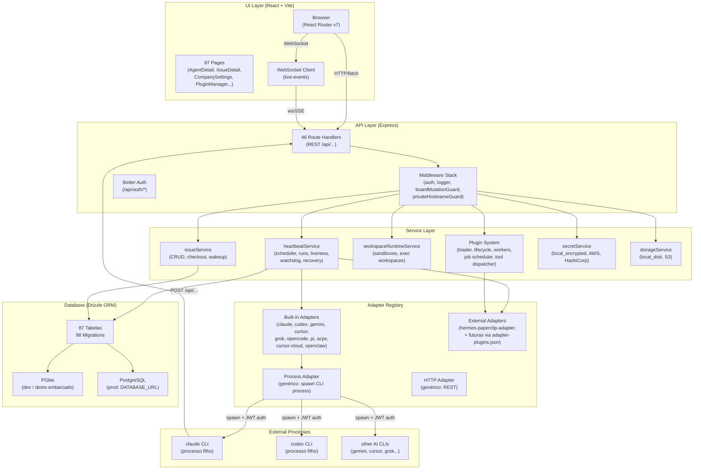
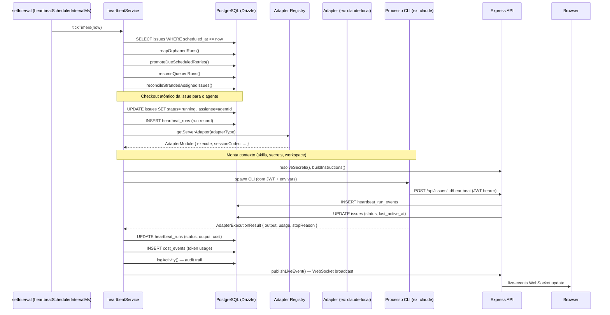

# System Architecture — now-company (Paperclip AIOX Fork)

> **Tipo:** Brownfield Discovery · **Data:** 2026-06-17 · **Autor:** @architect (Aria/AIOX)
> **Status:** Rascunho v1.0 — baseado em análise estática do repositório

---

## Executive Summary

O projeto **now-company** é um fork privado do [paperclipai/paperclip](https://github.com/paperclipai/paperclip), reposicionado como a plataforma de controle de agentes IA da organização. A stack é um monorepo pnpm com backend Express/Node.js + TypeScript, banco de dados PostgreSQL gerenciado pelo Drizzle ORM (com suporte a PGlite embarcado para dev), e frontend React 19 + Vite. O sistema atua como um **control plane**: gerencia empresas de agentes IA, delega execução de tarefas a agentes de CLI (Claude, Codex, Gemini, Cursor, etc.) por meio de adapters plugáveis, e mantém visibilidade total sobre runs, costs, aprovações e workspaces de execução.

A diferença central em relação ao upstream é a integração do ecossistema **AIOX** — arquivos de configuração em `.aiox-core/`, `.aiox/`, `.codex/`, `.claude/`, `.gemini/`, `.cursor/` indicam que o próprio repositório opera dentro do Paperclip como uma agent company. O fork também inclui patches locais na UI (acordeões `stderr_group` e `tool_group` no `RunTranscriptView`, excerpt no `LatestRunCard`) e extensões de rotas para métricas sociais, além de um adapter experimental `hermes-paperclip-adapter` carregado como plugin externo. O `adapter-plugin-store` e `plugin-loader` permitem que adapters externos sejam registrados dinamicamente sem modificação do código fonte.

A arquitetura segue um modelo **hub-and-spoke**: o servidor Express centraliza toda a orquestração, enquanto agentes-CLI rodam como processos externos e se comunicam de volta via API REST com JWT. A sincronização de estado é feita por WebSocket (SSE e ws) no canal `live-events`. O banco cresce em complexidade — 87 tabelas Drizzle, 98 migrations — e o serviço `heartbeat.ts` (361 KB) é o componente mais crítico e mais denso do sistema, implementando o scheduler de issues, recovery de runs, watchdog e liveness checks.

---

## 1. Stack e Dependências-Chave

### 1.1 Visão Geral do Workspace

| Workspace | Pacote | Versão | Papel |
|---|---|---|---|
| `server` | `@paperclipai/server` | — | Backend Express + orquestração |
| `ui` | `@paperclipai/ui` | — | SPA React + Vite |
| `cli` | `@paperclipai/cli` | — | CLI de gestão (`paperclipai` cmd) |
| `packages/db` | `@paperclipai/db` | 0.3.1 | Drizzle ORM + PGlite + migrations |
| `packages/shared` | `@paperclipai/shared` | 0.3.1 | Tipos, constantes, validadores Zod |
| `packages/adapter-utils` | `@paperclipai/adapter-utils` | 0.3.1 | Utilitários compartilhados entre adapters |
| `packages/mcp-server` | `@paperclipai/mcp-server` | 0.1.0 | Servidor MCP (stdio) para integração AI tools |
| `packages/plugins/sdk` | `@paperclipai/plugin-sdk` | 1.0.0 | SDK público para plugins |
| `packages/adapters/*` | (10 adapters) | 0.3.1 | Adapters de runtime por CLI/tool |

### 1.2 Dependências Críticas

| Dependência | Versão | Uso |
|---|---|---|
| `express` | ^5.x (inferido) | HTTP server, roteamento REST |
| `drizzle-orm` | ^0.45.2 | ORM type-safe para PostgreSQL |
| `drizzle-kit` | ^0.31.9 | Geração de migrations |
| `embedded-postgres` | ^18.1.0-beta.16 | PostgreSQL embarcado para dev/demo |
| `postgres` | ^3.4.5 | Driver Postgres (via Drizzle) |
| `better-auth` | (presente) | Autenticação/sessões |
| `@modelcontextprotocol/sdk` | ^1.29.0 | Protocolo MCP para integração com AI tools |
| `zod` | ^3.24.2 | Validação de schemas em runtime |
| `vitest` | ^3.0.5 | Testes unitários e integração |
| `playwright` | ^1.58.2 | Testes E2E |
| `typescript` | ^5.7.3 | Type checking (target: ESM) |
| `pnpm` | 9.15.4 | Package manager do monorepo |
| `react` | 19 (peer) | UI framework |
| `vite` | (via @paperclipai/ui) | Build + HMR do frontend |

### 1.3 Variáveis de Ambiente Principais

| Variável | Default | Descrição |
|---|---|---|
| `DATABASE_URL` | (não definida = PGlite) | Connection string PostgreSQL externo |
| `PAPERCLIP_DEPLOYMENT_MODE` | `local_trusted` | Modo de autenticação: `local_trusted \| authenticated` |
| `PAPERCLIP_DEPLOYMENT_EXPOSURE` | `private` | Exposição de rede |
| `PAPERCLIP_SECRETS_PROVIDER` | `local_encrypted` | Backend de secrets |
| `PAPERCLIP_STORAGE_PROVIDER` | `local_disk` | Backend de storage |
| `PAPERCLIP_STORAGE_S3_BUCKET` | `paperclip` | Bucket S3 (se aplicável) |
| `PAPERCLIP_AUTH_PUBLIC_BASE_URL` | (auto) | URL pública para auth |
| `PAPERCLIP_HEARTBEAT_SCHEDULER_ENABLED` | `true` | Liga/desliga o scheduler |
| `PAPERCLIP_MIGRATION_AUTO_APPLY` | (prompt interativo) | Auto-apply migrations no boot |
| `PORT` | 3100 | Porta HTTP (detect-port se ocupada) |

---

## 2. Mapa de Módulos e Responsabilidades

```
now-company/
├── server/src/
│   ├── index.ts              # Entrypoint: boot, DB init, migrations, startServer()
│   ├── app.ts                # Express app factory, middleware stack, route mounting
│   ├── config.ts             # Configuração via env vars + config file (JSON/YAML)
│   ├── routes/               # 46 arquivos de rotas REST (uma por domínio)
│   ├── services/             # 116 arquivos de lógica de negócio
│   │   ├── heartbeat.ts      # ⚠️ Módulo mais crítico (361 KB): scheduler de issues,
│   │   │                     #   execução de runs, liveness, watchdog, recovery
│   │   ├── workspace-runtime.ts  # Gerencia runtime services e execution workspaces
│   │   ├── company-portability.ts # Import/export de companies (182 KB)
│   │   ├── plugin-*.ts       # 20+ arquivos de plugin system (loader, lifecycle, workers)
│   │   └── secrets.ts        # Gestão de secrets (81 KB)
│   ├── adapters/
│   │   ├── registry.ts       # Registro estático de todos os adapters built-in
│   │   ├── plugin-loader.ts  # Carrega adapters externos via plugin system
│   │   ├── process/          # Adapter genérico para processos locais
│   │   └── http/             # Adapter genérico para HTTP
│   ├── realtime/
│   │   └── live-events-ws.ts # WebSocket server (SSE + ws) para eventos em tempo real
│   ├── middleware/            # auth, logger, boardMutationGuard, privateHostnameGuard
│   ├── secrets/               # Encryption, providers (local/AWS/HashiCorp)
│   └── storage/               # Abstração de storage (local_disk, S3)
│
├── ui/src/
│   ├── App.tsx               # Roteamento React Router v7 (87 páginas)
│   ├── pages/                # 87 arquivos de página (cada feature = uma página)
│   ├── components/           # Componentes compartilhados
│   ├── api/                  # Clientes de API REST (fetch wrappers por domínio)
│   ├── context/              # CompanyContext, DialogContext
│   ├── hooks/                # React hooks customizados
│   ├── i18n/                 # Internacionalização (i18next)
│   └── adapters/             # UI components específicos de adapters
│
├── packages/
│   ├── db/src/
│   │   ├── schema/           # 87 arquivos de schema Drizzle (uma tabela por arquivo)
│   │   ├── migrations/       # 98 migrations SQL geradas pelo drizzle-kit
│   │   └── client.ts         # Factory: PGlite (dev) ou postgres (prod)
│   ├── shared/src/           # Tipos compartilhados server/ui, constantes, Zod validators
│   ├── adapters/             # 10 adapters de runtime
│   │   ├── claude-local/     # Claude CLI (anthropic) — exports: server, ui, cli
│   │   ├── codex-local/      # OpenAI Codex CLI
│   │   ├── cursor-local/     # Cursor IDE (local)
│   │   ├── cursor-cloud/     # Cursor Cloud
│   │   ├── gemini-local/     # Gemini CLI (Google)
│   │   ├── grok-local/       # Grok (xAI)
│   │   ├── opencode-local/   # OpenCode CLI
│   │   ├── openclaw-gateway/ # OpenClaw gateway (cloud)
│   │   ├── pi-local/         # Pi AI
│   │   └── acpx-local/       # ACPX (interno AIOX)
│   ├── adapter-utils/        # Utilitários comuns (parse, session, sandbox cmds)
│   ├── mcp-server/           # Servidor MCP stdio (paperclip-mcp-server bin)
│   └── plugins/
│       ├── sdk/              # SDK público: worker API, UI bridge, testing
│       ├── create-paperclip-plugin/ # Scaffolding CLI para novos plugins
│       ├── plugin-llm-wiki/  # Plugin exemplo: wiki de LLMs
│       ├── plugin-workspace-diff/   # Plugin diff de workspaces
│       ├── paperclip-plugin-fake-sandbox/ # Sandbox fake para testes
│       ├── sandbox-providers/ # Providers de sandbox (excluídos do workspace lock)
│       └── examples/         # Exemplos de plugins (excluídos do workspace lock)
│
├── .aiox-core/               # Constituição e agentes AIOX (architect, dev, qa, etc.)
├── .aiox/ .codex/ .claude/ .gemini/ .cursor/ .antigravity/ # Config por tool
├── .github/workflows/        # 7 workflows CI/CD
│   ├── pr.yml                # PR checks: policy, typecheck, tests (matrix), build
│   ├── release.yml           # Release pipeline
│   ├── nightly.yml           # Testes noturnos
│   └── e2e.yml               # Playwright E2E
└── tests/
    ├── e2e/                  # Testes Playwright E2E
    └── release-smoke/        # Smoke tests de release
```

---

## 3. Arquitetura de Componentes



---

## 4. Fluxo de Execução de um Agente

> Ciclo completo: **heartbeat tick → checkout de issue → invocação do adapter → output → commit de estado**



### Estados de uma Issue

```
backlog → queued → running ──→ done
                    │
                    ├──→ waiting_approval → (approved) → queued
                    ├──→ failed
                    └──→ paused (budget hard-stop)
```

---

## 5. Plugin System

O sistema de plugins é uma extensão do core Paperclip que permite adicionar funcionalidades sem modificar o código principal:

| Componente | Arquivo | Responsabilidade |
|---|---|---|
| `plugin-loader.ts` (75 KB) | `server/src/services/` | Descobre e carrega plugins de diretórios locais e npm |
| `plugin-lifecycle.ts` (30 KB) | `server/src/services/` | Gerencia lifecycle (start/stop/restart) de workers |
| `plugin-worker-manager.ts` (46 KB) | `server/src/services/` | Pool de workers de plugin (Node.js child processes) |
| `plugin-job-scheduler.ts` (21 KB) | `server/src/services/` | Agendamento de jobs de plugin |
| `plugin-host-services.ts` (108 KB) | `server/src/services/` | Host API para plugins (database, secrets, tools) |
| `plugin-tool-dispatcher.ts` (15 KB) | `server/src/services/` | Dispatch de tools registradas por plugins |
| `plugin-registry.ts` (22 KB) | `server/src/services/` | Registry de plugins instalados |
| `plugin-event-bus.ts` (15 KB) | `server/src/services/` | Event bus inter-plugin |
| `@paperclipai/plugin-sdk` | `packages/plugins/sdk/` | API pública para autores de plugins |

**Extensão via Adapters:** O `adapter-plugin-store` permite registrar adapters como plugins externos via `~/.paperclip/adapter-plugins.json`, possibilitando que adapters como `hermes-paperclip-adapter` sejam carregados dinamicamente.

---

## 6. CI/CD

| Workflow | Trigger | Jobs |
|---|---|---|
| `pr.yml` | Pull Request → main/master | policy, typecheck+release-registry, general_tests (matrix: 3 grupos), build, verify_serialized_server (4 shards), canary_dry_run |
| `release.yml` | Manual / push tag | Build completo + publish npm |
| `nightly.yml` | Cron noturno | Testes adicionais |
| `e2e.yml` | Manual / schedule | Playwright E2E |
| `release-smoke.yml` | Após release | Smoke tests de instalação |
| `docker.yml` | Push | Build e push de imagem Docker |
| `refresh-lockfile.yml` | Cron semanal | Atualiza pnpm-lock.yaml automaticamente |

**Node.js target:** 24 (CI) / ≥20 (engines)
**Regra de lockfile:** PRs não podem commitar `pnpm-lock.yaml` — CI é o único dono.

---

## 7. Inventário de Débitos Técnicos

| ID | Débito | Área | Impacto | Esforço |
|---|---|---|---|---|
| DT-01 | **`heartbeat.ts` monolítico (361 KB, 10.062 linhas)** — toda a lógica de scheduling, recovery, execução, watchdog e liveness em um único arquivo | `server/services/heartbeat.ts` | Alto: impossível testar unidades isoladas; qualquer mudança tem blast radius enorme | Alto (refactor incremental necessário) |
| DT-02 | **`hermes-paperclip-adapter` importado diretamente no `registry.ts`** como built-in, mesmo que o AGENTS.md declare que deve ser externo (branch `feat/externalize-hermes-adapter`) | `server/src/adapters/registry.ts` (linhas 127-137) | Médio: contradição entre documentação e implementação; pode travar o processo de externalização | Médio |
| DT-03 | **`embedded-postgres` em versão beta** (`18.1.0-beta.16`) com patch local em `patches/` | `packages/db/package.json` | Médio: dependência instável sem suporte; patch pode quebrar em upgrades | Médio |
| DT-04 | **Ausência de testes unitários para `heartbeat.ts`** — apenas `heartbeat-stop-metadata.test.ts` (3 KB) para um arquivo de 361 KB | `server/services/` | Alto: área mais crítica do sistema sem cobertura adequada | Alto |
| DT-05 | **`company-portability.ts` (182 KB) e `issues.ts` (205 KB)** — serviços extremamente grandes sem submodularização | `server/services/` | Médio: dificuldade de manutenção e onboarding | Médio |
| DT-06 | **`(db as any)` espalhado em `index.ts`** — cast forçado para `any` em múltiplas chamadas (linhas 631, 651, 721, etc.) | `server/src/index.ts` | Médio: perde type-safety em pontos críticos de inicialização | Baixo |
| DT-07 | **Rotas de tamanho gigante** — `access.ts` (144 KB), `agents.ts` (121 KB), `issues.ts` (158 KB), `plugins.ts` (98 KB): handlers de rota sem separação de service layer clara | `server/src/routes/` | Médio: acoplamento route-service dificulta testes e reuso | Alto |
| DT-08 | **Comentário em PT-BR no código de produção** (`index.ts` linha 790-792: "Story 1.6 — sync de métricas sociais...") — viola convenções de comentários | `server/src/index.ts` | Baixo: inconsistência de padrão, mas documentação útil | Trivial |
| DT-09 | **`FEEDBACK_EXPORT_FLUSH_INTERVAL_MS` hardcoded** em `app.ts` (5_000 ms) sem exposição via config | `server/src/app.ts` | Baixo: não permite tuning sem deploy | Trivial |
| DT-10 | **Página `IssueDetail.tsx` (167 KB) e `Inbox.tsx` (110 KB)** — componentes de UI extremamente pesados, sem code splitting explícito | `ui/src/pages/` | Médio: bundle size e tempo de parse no browser | Médio |
| DT-11 | **`@types/node: ^24.6.0`** em devDependencies com patch de `embedded-postgres` — risco de breaking changes em major do Node | Múltiplos packages | Baixo: não afeta runtime, mas pode quebrar typecheck futuro | Baixo |
| DT-12 | **Plugin SDK sem testes de integração** — `packages/plugins/sdk/` tem apenas a estrutura de `testing.ts` mas não há suite de testes no CI para a API pública | `packages/plugins/sdk/` | Médio: regressões na API pública de plugins não são detectadas | Médio |
| DT-13 | **Dupla rota para `cloud-upstream`** no App.tsx (linhas 77 e 80 são idênticas) — rota duplicada | `ui/src/App.tsx` | Baixo: React Router ignora silenciosamente a segunda | Trivial |
| DT-14 | **`sandbox-providers/` excluídos do workspace lock** — dependências desses subpackages não são fixadas no `pnpm-lock.yaml`, criando risco de builds não-reproduzíveis | `pnpm-workspace.yaml` | Médio: CI pode ter comportamento diferente de dev local | Médio |
| DT-15 | **Sem monitoramento de rate limits no heartbeat scheduler** — `setInterval` não tem backpressure; se um tick leva mais que o intervalo, tickets empilham | `server/src/index.ts` | Alto: pode causar cascata de erros sob carga | Médio |

---

## 8. Perguntas para @data-engineer

> Questões abertas sobre a camada de dados que requerem investigação aprofundada:

1. **Estratégia de particionamento:** As tabelas `heartbeat_runs`, `heartbeat_run_events`, `cost_events` e `activity_log` crescem sem limite. Existe TTL, archiving ou particionamento planejado?

2. **Conexão pool:** O `client.ts` usa `postgres` (driver node-postgres). Como está configurado o pool de conexões em produção? O `createDb` cria um singleton ou instância por request?

3. **Migrations em produção:** Com 98 migrations e o fluxo interativo de `ensureMigrations()`, qual é o processo garantido para zero-downtime migrations? O `PAPERCLIP_MIGRATION_AUTO_APPLY=true` é usado em deploy?

4. **PGlite vs. PostgreSQL:** A API do `client.ts` abstrai os dois backends? Há features do PostgreSQL (ex: `LISTEN/NOTIFY`, CTEs recursivos, `jsonb` operators avançados) que não funcionam no PGlite?

5. **Backup do banco:** O `runDatabaseBackup` usa `pg_dump` via CLI? Como é gerenciado em ambientes Docker/containerizados onde o binário pode não estar disponível?

6. **Schema de secrets:** `company_secrets`, `company_secret_versions` e `company_secret_bindings` sugerem versionamento. Como está implementado o ciclo de rotação de secrets?

7. **Issue tree (`issue_tree_holds`, `issue_tree_hold_members`):** Qual é o modelo de dados para a estrutura de árvore de issues? Há risco de deadlock ao adquirir holds concorrentemente?

8. **`plugin_database.ts`:** Plugins têm seu próprio namespace de DB. Como é feito o isolamento? São schemas separados ou prefixos de tabela?

---

## 9. Perguntas para @ux-design-expert

> Questões abertas sobre a interface que requerem avaliação de UX/UI:

1. **87 páginas com importação direta:** Todas as páginas são importadas estaticamente em `App.tsx`. Há plano de lazy loading / React.lazy + Suspense para reduzir o bundle inicial?

2. **`IssueDetail.tsx` (167 KB) e `AgentDetail.tsx` (176 KB):** Esses são os componentes mais pesados do frontend. Existem componentes ou hooks duplicados entre eles? Qual é o padrão de composição adotado?

3. **Rota duplicada em `App.tsx`:** A rota `company/settings/cloud-upstream` aparece duas vezes (linhas 77 e 80). É um bug de copy-paste? Impacta alguma feature ativa?

4. **`DesignGuide.tsx` (58 KB):** Existe um design guide vivo dentro da aplicação. Está sincronizado com os componentes em `ui/src/components/`? É usado ativamente?

5. **`CloudUpstreamUxLab.tsx` e `IssueChatUxLab.tsx`:** Há páginas de UX Lab expostas na rota `/ux-lab/*`. Estas páginas são acessíveis em produção? Deveriam ser?

6. **Internacionalização:** A UI usa `i18next` mas os textos em `App.tsx` têm `defaultValue` em inglês. Quais locales são suportados ativamente? O arquivo `analyze-locales.mjs` revela gaps?

7. **`Inbox.tsx` (110 KB):** A página mais complexa da UI. Quais são os fluxos principais de usuário que passam por ela? Existe análise de performance (LCP, INP) para essa página?

8. **`OnboardingWizard` fora das Routes:** O wizard é renderizado globalmente em `App()` fora do `<Routes>`. Isso é intencional (modal global) ou pode causar problemas de navegação/estado?

---

## 10. Referências

| Documento | Caminho |
|---|---|
| Especificação de implementação V1 | `doc/SPEC-implementation.md` |
| Objetivo do produto | `doc/GOAL.md` |
| Guia de desenvolvimento | `doc/DEVELOPING.md` |
| Schema do banco | `doc/DATABASE.md` |
| Constituição AIOX | `.aiox-core/constitution.md` |
| Adapters como plugins externos | `adapter-plugin.md` |
| Changelog do DB package | `packages/db/CHANGELOG.md` |

---

*Documento gerado por análise estática brownfield — não substitui documentação viva. Deve ser revisado após cada sprint maior.*
