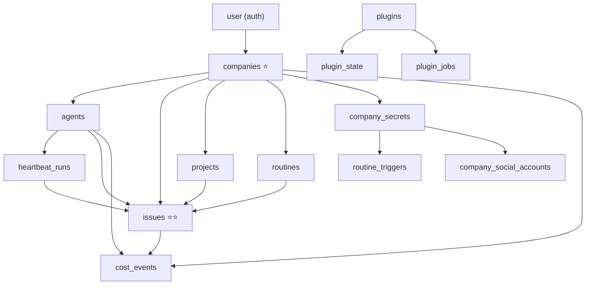

# Schema de Banco de Dados — Paperclip (now-company)

> **Gerado em:** 2026-06-17 | **Revisão do schema:** migration 0097 | **Total de tabelas:** 97
> **Stack:** Drizzle ORM + PostgreSQL (PGlite para dev) | **Localização:** `packages/db/src/schema/`

---

## Índice de Domínios

1. [Auth & Usuários](#1-auth--usuários)
2. [Companies (Multi-tenant Core)](#2-companies-multi-tenant-core)
3. [Agents & Runtime](#3-agents--runtime)
4. [Issues (Task Management)](#4-issues-task-management)
5. [Projects, Goals & Workspaces](#5-projects-goals--workspaces)
6. [Routines (Automação)](#6-routines-automação)
7. [Costs & Finance](#7-costs--finance)
8. [Approvals & Governance](#8-approvals--governance)
9. [Documents & Annotations](#9-documents--annotations)
10. [Secrets & Segurança](#10-secrets--segurança)
11. [Plugins System](#11-plugins-system)
12. [Social Media](#12-social-media)
13. [Cloud & Infra](#13-cloud--infra)
14. [Feedback & Qualidade](#14-feedback--qualidade)
15. [Configurações de Instância](#15-configurações-de-instância)

---

## 1. Auth & Usuários

### `user` (auth.ts)
| Coluna | Tipo | Constraints | Observações |
|--------|------|-------------|-------------|
| `id` | text | PK | ID de string (Better Auth) |
| `name` | text | NOT NULL | — |
| `email` | text | NOT NULL | **Sem índice único!** |
| `email_verified` | boolean | NOT NULL DEFAULT false | — |
| `image` | text | nullable | — |
| `locale` | text | NOT NULL DEFAULT 'en' | Adicionado na migration 0093 |
| `created_at` | timestamp+tz | NOT NULL | — |
| `updated_at` | timestamp+tz | NOT NULL | — |

**Índices:** Nenhum  
**FKs:** Referenciada por `session`, `account`, `board_api_keys`, `cli_auth_challenges`  
> ⚠️ `email` sem índice único — vulnerável a duplicação de e-mails.

---

### `session` (auth.ts)
| Coluna | Tipo | Constraints |
|--------|------|-------------|
| `id` | text | PK |
| `expires_at` | timestamp+tz | NOT NULL |
| `token` | text | NOT NULL |
| `ip_address` | text | nullable |
| `user_agent` | text | nullable |
| `user_id` | text | NOT NULL → `user.id` ON DELETE CASCADE |
| `created_at` / `updated_at` | timestamp+tz | NOT NULL |

**Índices:** Nenhum explícito além da FK

---

### `account` (auth.ts)
| Coluna | Tipo | Constraints |
|--------|------|-------------|
| `id` | text | PK |
| `account_id` / `provider_id` | text | NOT NULL |
| `user_id` | text | NOT NULL → `user.id` ON DELETE CASCADE |
| `access_token` / `refresh_token` / `id_token` | text | nullable (sensível) |
| `access_token_expires_at` / `refresh_token_expires_at` | timestamp+tz | nullable |
| `scope` / `password` | text | nullable |
| `created_at` / `updated_at` | timestamp+tz | NOT NULL |

> ⚠️ Tokens OAuth armazenados em plaintext — deve ser mitigado por criptografia em nível de app/storage.

---

### `verification` (auth.ts)
Tokens de verificação de e-mail com `expires_at`. `created_at` e `updated_at` são **nullable** aqui (inconsistência com demais tabelas).

---

### `board_api_keys`
| Coluna | Tipo | Constraints |
|--------|------|-------------|
| `id` | uuid | PK |
| `user_id` | text | NOT NULL → `user.id` ON DELETE CASCADE |
| `name` | text | NOT NULL |
| `key_hash` | text | NOT NULL |
| `last_used_at` / `revoked_at` / `expires_at` | timestamp+tz | nullable |
| `created_at` | timestamp+tz | NOT NULL |

**Índices:** `key_hash` (UNIQUE), `user_id`  
**Soft delete:** via `revoked_at` — sem `deleted_at` formal

---

### `instance_user_roles`
| Coluna | Tipo | Constraints |
|--------|------|-------------|
| `id` | uuid | PK |
| `user_id` | text | NOT NULL — **sem FK para `user.id`!** |
| `role` | text | NOT NULL DEFAULT 'instance_admin' |
| `created_at` / `updated_at` | timestamp+tz | NOT NULL |

**Índices:** `(user_id, role)` UNIQUE, `role`  
> ⚠️ Sem FK referenciando `user.id` — risco de registros órfãos.

---

### `cli_auth_challenges`
Desafios de autenticação CLI com lifecycle de aprovação. Referencia `companies`, `user`, `board_api_keys`.

---

## 2. Companies (Multi-tenant Core)

### `companies` ⭐ (tabela raiz do multi-tenant)
| Coluna | Tipo | Constraints | Observações |
|--------|------|-------------|-------------|
| `id` | uuid | PK DEFAULT random | — |
| `name` | text | NOT NULL | — |
| `description` | text | nullable | — |
| `status` | text | NOT NULL DEFAULT 'active' | active / paused |
| `pause_reason` | text | nullable | — |
| `paused_at` | timestamp+tz | nullable | — |
| `issue_prefix` | text | NOT NULL DEFAULT 'PAP' | — |
| `issue_counter` | integer | NOT NULL DEFAULT 0 | Contador incremental |
| `budget_monthly_cents` | integer | NOT NULL DEFAULT 0 | — |
| `spent_monthly_cents` | integer | NOT NULL DEFAULT 0 | — |
| `attachment_max_bytes` | integer | NOT NULL DEFAULT 10485760 | — |
| `require_board_approval_for_new_agents` | boolean | NOT NULL DEFAULT false | — |
| `feedback_data_sharing_enabled` | boolean | NOT NULL DEFAULT false | — |
| `feedback_data_sharing_consent_at` | timestamp+tz | nullable | — |
| `feedback_data_sharing_consent_by_user_id` | text | nullable | **Sem FK!** |
| `feedback_data_sharing_terms_version` | text | nullable | — |
| `brand_color` | text | nullable | — |
| `created_at` / `updated_at` | timestamp+tz | NOT NULL | — |
| 🆕 `kind` | — | — | **PENDENTE** — discriminador personal/business |
| 🆕 `owner_user_id` | — | — | **PENDENTE** → `user.id` |

**Índices:** `issue_prefix` (UNIQUE)  
**Soft delete:** Nenhum `deleted_at` — usa `status='paused'` como alternativa parcial

---

### `company_memberships`
| Coluna | Tipo | Constraints |
|--------|------|-------------|
| `id` | uuid | PK |
| `company_id` | uuid | NOT NULL → `companies.id` |
| `principal_type` | text | NOT NULL (user / agent) |
| `principal_id` | text | NOT NULL |
| `status` | text | NOT NULL DEFAULT 'active' |
| `membership_role` | text | nullable |
| `created_at` / `updated_at` | timestamp+tz | NOT NULL |

**Índices:** `(company_id, principal_type, principal_id)` UNIQUE, `(principal_type, principal_id, status)`, `(company_id, status)`

---

### `company_logos`
Relação 1-to-1 empresa ↔ asset de logo. Cascade nas duas FKs.

### `company_user_sidebar_preferences`
Ordem de projetos na sidebar por usuário/empresa. `user_id` é text sem FK.

### `user_sidebar_preferences`
Ordem de empresas na sidebar global do usuário. `user_id` é text sem FK.

### `invites`
Tokens de convite com `revoked_at` e `accepted_at`. `invited_by_user_id` sem FK.

### `join_requests`
Requisições de join (humano ou agente) com partial UNIQUE indexes para deduplicação.

### `principal_permission_grants`
Grants de permissão por principal (usuário/agente) dentro de uma empresa.

### `inbox_dismissals`
Registro de dismissals de itens da inbox por usuário.

---

## 3. Agents & Runtime

### `agents` ⭐
| Coluna | Tipo | Constraints | Observações |
|--------|------|-------------|-------------|
| `id` | uuid | PK | |
| `company_id` | uuid | NOT NULL → `companies.id` | |
| `name` | text | NOT NULL | |
| `role` | text | NOT NULL DEFAULT 'general' | |
| `title` / `icon` | text | nullable | |
| `status` | text | NOT NULL DEFAULT 'idle' | idle / running / paused |
| `reports_to` | uuid | nullable → `agents.id` | Self-referência hierárquica |
| `adapter_type` | text | NOT NULL DEFAULT 'process' | |
| `adapter_config` / `runtime_config` / `permissions` | jsonb | NOT NULL DEFAULT {} | |
| `default_environment_id` | uuid | → `environments.id` ON DELETE SET NULL | |
| `budget_monthly_cents` / `spent_monthly_cents` | integer | NOT NULL DEFAULT 0 | |
| `last_heartbeat_at` | timestamp+tz | nullable | |
| `metadata` | jsonb | nullable | |
| `created_at` / `updated_at` | timestamp+tz | NOT NULL | |

**Índices:** `(company_id, status)`, `(company_id, reports_to)`, `(company_id, default_environment_id)`

---

### `agent_api_keys`
Chaves de API para agentes. `key_hash` UNIQUE. Soft delete via `revoked_at`.

### `agent_config_revisions`
Histórico de mudanças de config de agentes (before/after JSON). `rolled_back_from_revision_id` sem FK.

### `agent_memberships`
Usuários membros de agentes. `user_id` text sem FK.

### `agent_runtime_state`
Estado de runtime 1-to-1 com agent (PK = FK). `last_run_id` sem FK para `heartbeat_runs`.

### `agent_task_sessions`
Sessões de tasks persistentes por agente/adapter. UNIQUE em `(company_id, agent_id, adapter_type, task_key)`.

### `agent_wakeup_requests`
Fila de wakeups de agentes. `run_id` sem FK.

---

### `heartbeat_runs` ⭐
| Coluna | Tipo | Constraints | Observações |
|--------|------|-------------|-------------|
| `id` | uuid | PK | |
| `company_id` / `agent_id` | uuid | NOT NULL | |
| `status` | text | NOT NULL DEFAULT 'queued' | |
| `started_at` / `finished_at` | timestamp+tz | nullable | |
| `wakeup_request_id` | uuid | → `agent_wakeup_requests.id` | |
| `retry_of_run_id` | uuid | → `heartbeat_runs.id` (self-ref) ON DELETE SET NULL | |
| `liveness_state` / `liveness_reason` | text | nullable | |
| `continuation_attempt` | integer | NOT NULL DEFAULT 0 | |
| `last_useful_action_at` | timestamp+tz | nullable | |
| `context_snapshot` | jsonb | nullable | |
| `created_at` / `updated_at` | timestamp+tz | NOT NULL | |

**Índices:** `(company_id, agent_id, started_at)`, `(company_id, liveness_state, created_at)`, compound status indexes

---

### `heartbeat_run_events`
Log de eventos de runs com `bigserial` como PK (alta inserção). Sem `updated_at`.

### `heartbeat_run_watchdog_decisions`
Decisões do watchdog sobre runs (snooze, terminate, etc.).

---

## 4. Issues (Task Management)

### `issues` ⭐⭐ (tabela mais complexa do sistema — 144 linhas)
| Coluna | Tipo | Constraints | Observações |
|--------|------|-------------|-------------|
| `id` | uuid | PK | |
| `company_id` | uuid | NOT NULL → `companies.id` | |
| `project_id` | uuid | nullable → `projects.id` | |
| `project_workspace_id` | uuid | → `project_workspaces.id` ON DELETE SET NULL | |
| `goal_id` | uuid | nullable → `goals.id` | |
| `parent_id` | uuid | nullable → `issues.id` (self-ref) | Hierarquia de subtasks |
| `title` | text | NOT NULL | GIN trigram index |
| `description` | text | nullable | GIN trigram index |
| `status` | text | NOT NULL DEFAULT 'backlog' | backlog/todo/in_progress/in_review/blocked/done/cancelled |
| `work_mode` | text | NOT NULL DEFAULT 'standard' | |
| `priority` | text | NOT NULL DEFAULT 'medium' | |
| `assignee_agent_id` | uuid | → `agents.id` | |
| `assignee_user_id` | text | nullable — **sem FK!** | |
| `checkout_run_id` / `execution_run_id` | uuid | → `heartbeat_runs.id` ON DELETE SET NULL | |
| `origin_kind` / `origin_fingerprint` | text | NOT NULL | Controle de deduplicação |
| `execution_workspace_id` | uuid | → `execution_workspaces.id` ON DELETE SET NULL | |
| `monitor_next_check_at` | timestamp+tz | nullable | Indexado |
| `hidden_at` | timestamp+tz | nullable | **Soft delete parcial** |
| `started_at` / `completed_at` / `cancelled_at` | timestamp+tz | nullable | |
| `created_at` / `updated_at` | timestamp+tz | NOT NULL | |

**Índices:** 14 no total — inclui GIN trigram (title, description, identifier), partial UNIQUE indexes para deduplicação de routine executions, liveness recovery e stale run evaluations.

**Tabelas filho de `issues`:**
- `issue_comments` — comentários com GIN trigram em `body`
- `issue_labels` — junção com `labels` (PK composta)
- `issue_approvals` — junção com `approvals` (PK composta)
- `issue_attachments` — assets vinculados
- `issue_documents` — documentos vinculados (key UNIQUE por issue)
- `issue_relations` — relações entre issues (`blocks` type)
- `issue_read_states` — último `last_read_at` por usuário
- `issue_inbox_archives` — arquivamento na inbox
- `issue_execution_decisions` — decisões de execução por etapa
- `issue_thread_interactions` — interações em thread com idempotência
- `issue_recovery_actions` — ações de recuperação automática
- `issue_reference_mentions` — menções cruzadas entre issues
- `issue_tree_holds` + `issue_tree_hold_members` — holds hierárquicos
- `issue_work_products` — artifacts gerados (PRs, builds)

---

### `labels`
Labels de empresa para categorizar issues. `(company_id, name)` UNIQUE.

---

## 5. Projects, Goals & Workspaces

### `projects`
| Coluna | Tipo | Constraints | Observações |
|--------|------|-------------|-------------|
| `id` | uuid | PK | |
| `company_id` | uuid | NOT NULL → `companies.id` | |
| `goal_id` | uuid | nullable → `goals.id` | |
| `name` | text | NOT NULL | |
| `status` | text | NOT NULL DEFAULT 'backlog' | |
| `lead_agent_id` | uuid | → `agents.id` | |
| `target_date` | date | nullable | |
| `archived_at` | timestamp+tz | nullable | Soft delete via timestamp |
| `env` | jsonb | nullable | |
| `created_at` / `updated_at` | timestamp+tz | NOT NULL | |

**Índices:** Apenas `company_id` — sem índice em `(company_id, status)`.

---

### `goals`
Hierarquia de objetivos com self-reference `parent_id`. Apenas `company_id` indexado.

### `project_goals`
Junção many-to-many projects ↔ goals com PK composta.

### `project_memberships`
Membros de projetos. `user_id` text sem FK.

### `project_workspaces`
Workspaces de código vinculados a projetos (local_path, git remote).

### `execution_workspaces`
Workspaces efêmeros criados para runs. Auto-referência `derived_from_execution_workspace_id`.

### `environments`
Environments por empresa (driver: local, remote). Partial UNIQUE para driver='local'.

### `environment_leases`
Alocações de environments para execuções.

### `workspace_operations`
Log de operações em workspaces (setup, cleanup, build).

### `workspace_runtime_services`
Serviços de runtime ativos (dev servers, databases efêmeros).

---

## 6. Routines (Automação)

### `routines`
| Coluna | Tipo | Constraints | Observações |
|--------|------|-------------|-------------|
| `id` | uuid | PK | |
| `company_id` | uuid | NOT NULL → `companies.id` ON DELETE CASCADE | |
| `project_id` | uuid | → `projects.id` ON DELETE CASCADE | |
| `assignee_agent_id` | uuid | → `agents.id` | |
| `status` | text | NOT NULL DEFAULT 'active' | |
| `variables` | jsonb | NOT NULL DEFAULT [] | |
| `latest_revision_id` | uuid | nullable — **sem FK!** | |
| `created_at` / `updated_at` | timestamp+tz | NOT NULL | |

### `routine_revisions`
Snapshots imutáveis de revisões. UNIQUE em `(routine_id, revision_number)`.

### `routine_triggers`
| Coluna | Tipo | Observações |
|--------|------|-------------|
| `kind` | text | cron / webhook / manual |
| `cron_expression` | text | nullable |
| `next_run_at` | timestamp+tz | Indexado para scheduling |
| `public_id` | text | UNIQUE — usado em URLs de webhook |
| `secret_id` | uuid | → `company_secrets.id` — assinatura HMAC |

### `routine_runs`
Histórico de execuções com idempotência e fingerprint de dispatch.

---

## 7. Costs & Finance

### `cost_events` ⭐
| Coluna | Tipo | Constraints |
|--------|------|-------------|
| `id` | uuid | PK |
| `company_id` | uuid | NOT NULL → `companies.id` |
| `agent_id` | uuid | NOT NULL → `agents.id` |
| `issue_id` / `project_id` / `goal_id` | uuid | nullable → respectivas tabelas |
| `heartbeat_run_id` | uuid | → `heartbeat_runs.id` |
| `provider` / `biller` / `billing_type` / `model` | text | NOT NULL |
| `input_tokens` / `cached_input_tokens` / `output_tokens` | integer | NOT NULL DEFAULT 0 |
| `cost_cents` | integer | NOT NULL |
| `occurred_at` | timestamp+tz | NOT NULL |
| `created_at` | timestamp+tz | NOT NULL |

**Índices:** 5 — `(company+occurred)`, `(company+agent+occurred)`, `(company+provider+occurred)`, `(company+biller+occurred)`, `(company+run)`

---

### `finance_events`
Eventos financeiros de alto nível (debit/credit) com referência a `cost_events`.

### `budget_policies`
Políticas de orçamento por escopo com UNIQUE em `(company_id, scope_type, scope_id, metric, window_kind)`.

### `budget_incidents`
Violações de orçamento, linkadas a `approvals` para aprovação de desbloqueio.

---

## 8. Approvals & Governance

### `approvals`
| Coluna | Tipo | Constraints |
|--------|------|-------------|
| `id` | uuid | PK |
| `company_id` | uuid | NOT NULL → `companies.id` |
| `type` | text | NOT NULL |
| `requested_by_agent_id` | uuid | → `agents.id` |
| `status` | text | NOT NULL DEFAULT 'pending' |
| `payload` | jsonb | NOT NULL |
| `decided_by_user_id` | text | nullable — **sem FK!** |
| `decided_at` | timestamp+tz | nullable |
| `created_at` / `updated_at` | timestamp+tz | NOT NULL |

**Índices:** `(company_id, status, type)`

---

### `approval_comments`
Comentários em approvals. Triplo índice `(approval_id)`, `(company_id)`, `(approval_id, created_at)`.

### `activity_log`
| Coluna | Tipo | Observações |
|--------|------|-------------|
| `actor_type` / `actor_id` | text | NOT NULL |
| `action` / `entity_type` / `entity_id` | text | NOT NULL |
| `agent_id` / `run_id` | uuid | nullable |
| `details` | jsonb | nullable |
| `created_at` | timestamp+tz | NOT NULL — **sem `updated_at`** |

---

## 9. Documents & Annotations

### `documents`
| Coluna | Tipo | Observações |
|--------|------|-------------|
| `latest_body` | text | NOT NULL — cópia desnormalizada da última revisão |
| `latest_revision_id` | uuid | nullable — **sem FK para `document_revisions`!** |
| `locked_at` + `locked_by_agent_id` + `locked_by_user_id` | — | Sistema de lock otimista |

**Índices:** GIN trigram em `title` e `latest_body` para full-text search.

### `document_revisions`
Histórico imutável. UNIQUE em `(document_id, revision_number)`.

### `document_annotation_threads`
Threads de anotação anchored em seleção de texto de documentos.

### `document_annotation_comments`
Comentários em annotation threads com GIN em `body`.

### `document_annotation_anchor_snapshots`
Snapshots de anchor ao longo das revisões para rastrear drift de posição.

### `assets`
Arquivos/blobs referenciados por issues e empresas. UNIQUE em `(company_id, object_key)`.

---

## 10. Secrets & Segurança

### `company_secrets`
| Coluna | Tipo | Observações |
|--------|------|-------------|
| `key` / `name` | text | Ambos UNIQUE por company |
| `provider` | text | local_encrypted / vault / aws_ssm |
| `status` | text | active / revoked |
| `deleted_at` | timestamp+tz | **Soft delete implementado aqui!** |

### `company_secret_versions`
Versões de secrets com checksum e rotação. UNIQUE em `(secret_id, version)`.

### `company_secret_bindings`
Bindings de secrets para agentes/projetos em caminhos de config específicos.

### `company_secret_provider_configs`
Provedores externos (Vault, AWS SSM). Partial UNIQUE para `is_default`.

### `secret_access_events`
Auditoria imutável de acessos a secrets. Sem `updated_at`.

---

## 11. Plugins System

| Tabela | Propósito |
|--------|-----------|
| `plugins` | Registro de plugins instalados com manifest JSONB |
| `plugin_config` | Config instância-wide por plugin (1-to-1) |
| `plugin_company_settings` | Enabled/disabled + settings por empresa/plugin |
| `plugin_state` | KV store scoped (instance/company/project/agent/issue/goal/run) |
| `plugin_entities` | Mapeamento entidades Paperclip ↔ IDs externos |
| `plugin_jobs` | Jobs agendados declarados no manifest |
| `plugin_job_runs` | Histórico de execuções de jobs |
| `plugin_webhook_deliveries` | Histórico de entregas de webhooks inbound |
| `plugin_logs` | Logs estruturados de workers |
| `plugin_database_namespaces` | Namespaces de DB isolados por plugin |
| `plugin_migrations` | Ledger de migrations por plugin |
| `plugin_managed_resources` | Recursos de infra gerenciados por plugins |

---

## 12. Social Media

### `social_platforms` (migration 0094)
Catálogo global de plataformas gerenciado por Super Admin. UNIQUE em `slug`.
Campos OAuth adicionados na migration 0097: `oauth_app_id`, `oauth_app_secret_enc`, `oauth_redirect_uri`, `implementation_status`.

### `company_social_accounts` (migration 0095-0096)
Contas de redes sociais por empresa. Tokens OAuth via `company_secrets` (campo `secret_id`).
`needs_reauth` boolean adicionado na migration 0096.

---

## 13. Cloud & Infra

### `cloud_upstream_connections`
Conexões com instâncias Paperclip Cloud upstream. Armazena chaves privadas e tokens (sensível).

### `cloud_upstream_runs`
Histórico de sincronizações com o upstream.

### `company_skills`
Skills (instruções markdown de agentes) por empresa. UNIQUE em `(company_id, key)`.

---

## 14. Feedback & Qualidade

### `feedback_votes`
Votos de qualidade (up/down) em execuções. UNIQUE por `(company_id, target_type, target_id, author_user_id)`.

### `feedback_exports`
Exportação de feedback para laboratórios com controle de consentimento.

---

## 15. Configurações de Instância

### `instance_settings`
Singleton com configurações da instância (`general` + `experimental` JSONB). UNIQUE em `singleton_key`.

### `instance_user_roles`
Roles de instância (instance_admin). UNIQUE em `(user_id, role)`. **Sem FK para `user.id`.**

---

## Diagrama de Relações Principais

---

## Contagem por Domínio

| Domínio | Tabelas |
|---------|---------|
| Auth & Usuários | 7 |
| Companies | 9 |
| Agents & Runtime | 8 |
| Issues | 15 |
| Projects, Goals & Workspaces | 8 |
| Routines | 4 |
| Costs & Finance | 4 |
| Approvals & Governance | 3 |
| Documents & Annotations | 6 |
| Secrets & Segurança | 5 |
| Plugins | 12 |
| Social Media | 2 |
| Cloud & Infra | 3 |
| Feedback | 2 |
| Configurações | 2 |
| **Total** | **97** |

---

*Documentação gerada por Dara (@data-engineer) em 2026-06-17 com base na leitura direta dos 87 arquivos de schema (migration 0097 é a mais recente).*
